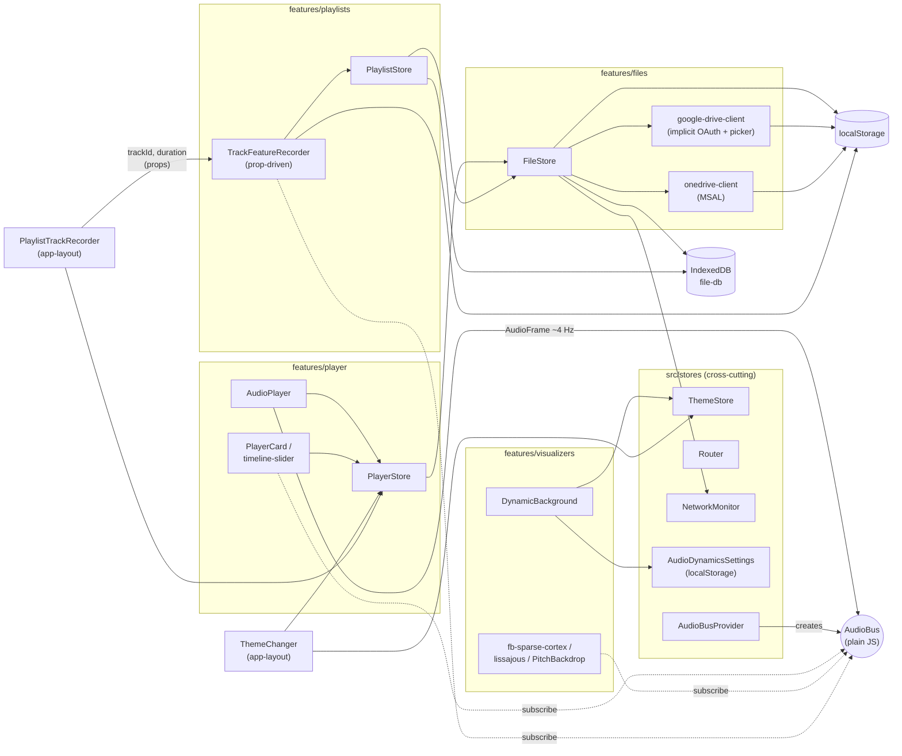
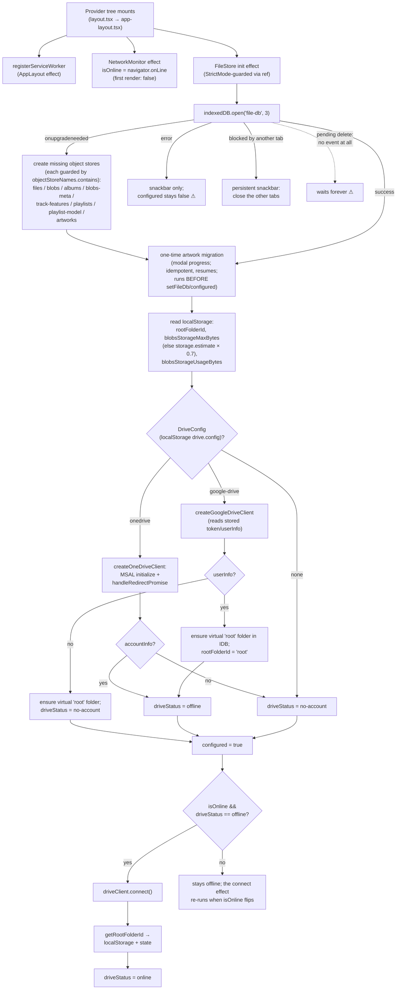
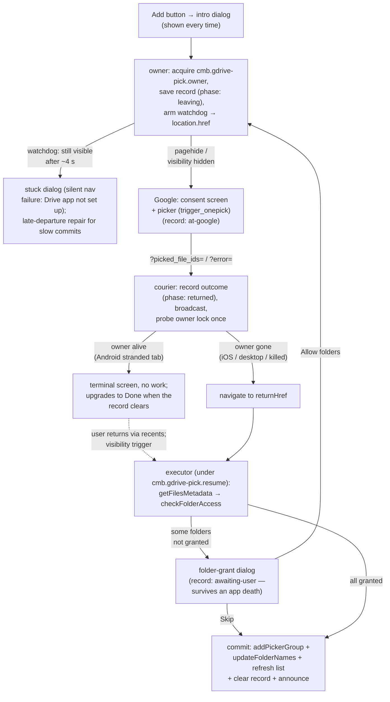
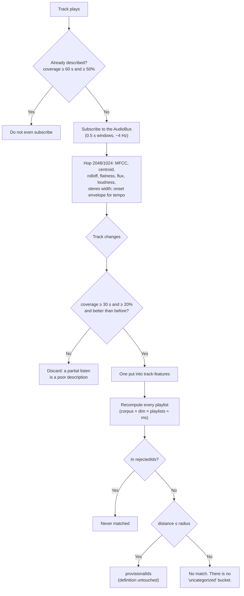
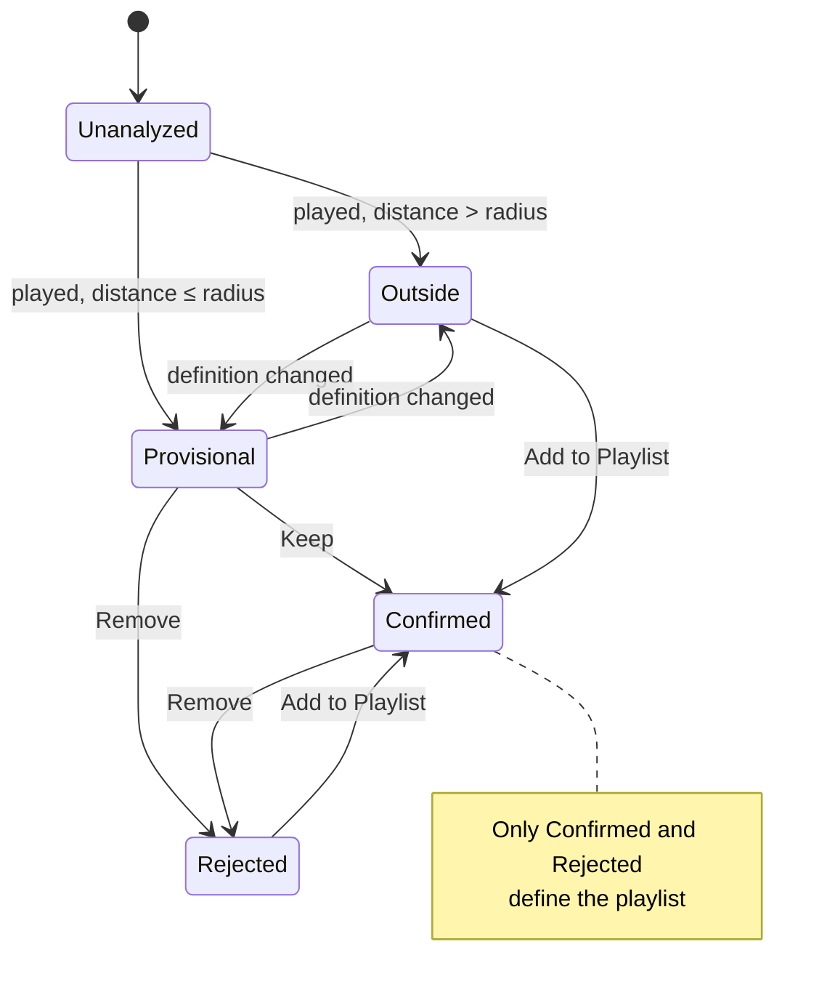

# Cloud Music Box — Architecture

Last updated: 2026-08 (added the playlists feature: per-track acoustic descriptors
and seed-grown playlists; `file-db` moved to version 2).

## Overview

Cloud Music Box is a **static-export PWA** (Next.js 14 App Router, `output: "export"`).
There is no server runtime: OAuth flows, cloud-drive access, audio decoding/analysis,
and offline caching all happen in the browser. Offline playback is backed by IndexedDB;
the app shell is precached by a Serwist service worker.

Core design principles:

- **Client-only.** Everything runs in the browser; deployment is static files.
- **High-frequency data flows outside React.** Audio analysis frames (~4 Hz) and the
  playback position are delivered through a plain-JS pub/sub bus (`AudioBus`), never
  through React context state. React state is reserved for low-frequency UI state.
- **No singletons.** Shared services (the audio bus) are created by factories and
  injected via context providers. The instance is immutable, so providing it through
  context causes no re-renders.
- **Feature-based layout with strict placement rules** (see below).

## Folder structure and placement rules

```text
app/                       # Next.js routes. Pages compose features; keep them thin.
src/
  features/
    player/                # Playback domain
      components/          #   audio-player, player-card, timeline-slider
      stores/              #   player-store
      index.ts             #   public API
    files/                 # Cloud-drive browsing + local cache domain
      components/          #   file-list, file-list-item, track-list
      api/                 #   base-drive-client, google-drive-client, onedrive-client
      stores/              #   file-store
      index.ts             #   public API
    visualizers/           # Audio visualization domain
      components/          #   dynamic-background, fb-sparse-cortex, lissajous-curve
      lib/                 #   pitch helpers
      index.ts             #   public API
    playlists/             # Seed-grown playlists + per-track descriptors
      components/          #   track-feature-recorder, playlist-name-dialog
      hooks/               #   use-playlist-actions (menu items + dialogs for pages)
      lib/                 #   analysis-setting (localStorage)
      stores/              #   playlist-store
      index.ts             #   public API
  components/              # Cross-cutting UI atoms (app-top-bar, marquee-text, covers, ...)
  stores/                  # Cross-cutting React providers (theme, network, router,
                           # audio-bus-provider, audio-dynamics-settings)
  hooks/                   # Cross-cutting React hooks
  lib/                     # Cross-cutting non-React logic (MUST NOT import React)
    audio/                 #   audio-bus, audio-frame, audio-analyser,
                           #   track-feature-accumulator
    playlists/             #   feature-space (robust z), prototype (Rocchio + membership)
    theming/               #   album-art color extraction (worker)
    idb/                   #   idbRequest promise wrapper
    gtag.ts
```

**Placement decision tree** (every new module resolves uniquely):

1. Is it a page? → `app/<route>/`
2. Is it specific to one domain (player / files / visualizers)? → `features/<domain>/…`
3. Is it cross-cutting UI? → `src/components/`
4. Is it a cross-cutting React provider or hook? → `src/stores/` or `src/hooks/`
5. Is it cross-cutting non-React logic? → `src/lib/` (subfolder per subsystem)

**Dependency rules:**

- Features may import freely from shared code (`src/components`, `src/stores`,
  `src/hooks`, `src/lib`).
- Feature→feature imports go through the target's `index.ts` only, and there are
  exactly two allowed edges: **player → files** (playback needs track content)
  and **playlists → files** (descriptors and playlists live in the same
  IndexedDB connection, and playlist pages resolve track ids to file records).
  No cycles: files depends on neither, and playlists does not import player.
  List components (`FileList`, `TrackList`) expose `onPlayTracks` /
  `activeFileId` / `extraMenuItems` props and the **pages** wire them to
  `usePlayerStore` / `usePlaylistActions` — cross-feature composition happens at
  the page layer. `TrackFeatureRecorder` follows the same rule from the other
  direction: it takes the active track as a prop rather than reading the player
  store, and `app-layout.tsx` supplies it.
- `src/lib/` never imports React. React glue for a lib subsystem (e.g. the audio-bus
  provider) lives in `src/stores/`.
- **Bundle-isolation exception:** a page may deep-import a specific `features/*/api`
  module instead of the feature index when the index would drag heavy unrelated code
  into a lightweight route (documented at the import site). Current use:
  `app/redirect/google-drive` imports `features/files/api/google-drive-client`
  directly to avoid bundling MSAL (+220 kB) into the OAuth callback.
- `audio-dynamics-settings` lives in `src/stores/` (not in visualizers) because it is
  consumed by three domains (settings page, player-card, visualizers) — rule 4.

## Audio pipeline

```text
HTMLAudioElement (features/player/components/audio-player.tsx)
  │  timeupdate (~4 Hz while playing; also fires on seek while paused)
  ▼
createAudioAnalyser (src/lib/audio/audio-analyser.ts)
  │  • one OfflineAudioContext(44.1 kHz) is used ONLY as a decoder:
  │    decodeAudioData resamples the whole track to 44.1 kHz PCM once per track
  │  • analyze(t) slices the 0.5 s window [t, t+0.5) as zero-copy subarray views
  │    into the decoded PCM (no per-frame render, no per-frame allocation;
  │    only the final short window of a track falls back to a zero-padded copy)
  │  • pitch/RMS per channel via FFT autocorrelation on a reused 2048-sample
  │    scratch buffer (autoCorrelate mutates its input, so views are never passed)
  ▼
AudioFrame { timeSeconds, pitch0/1, rms0/1, sampleRate: 44100, samples0/1 }
  │
  ▼
AudioBus (src/lib/audio/audio-bus.ts, created per app by AudioBusProvider)
  ├─ fb-sparse-cortex   … stitches windows by file position; drives its own Logic loop
  ├─ lissajous-curve    … writes frames into a mutable render context (no re-render)
  ├─ PitchBackdrop      … pitch → CSS background color (local state in a memo leaf)
  ├─ timeline-slider    … playback position display (local state in a memo leaf)
  └─ track-feature-accumulator … MFCC/centroid/flux/tempo statistics for playlists
                                 (subscribed by TrackFeatureRecorder; ~1 ms of CPU
                                  per second of audio, and not subscribed at all
                                  once a track is described well enough)
```

**AudioFrame contract:** `samples0/1` are **read-only views** into the decoded track
buffer. Consumers must never write to them (destructive processing must copy first).
Frames are immutable snapshots in the sense that the underlying decoded buffer never
changes for the lifetime of a track; on track switch old views keep referencing the
old buffer (GC keeps it alive while referenced).

**Playback position access patterns** (the player store is *not* updated at 4 Hz):

1. **Display (needs re-render):** subscribe to the bus and keep local state at the
   granularity you render (`timeline-slider` keeps raw seconds; its text is a memoized
   child receiving `~~seconds`). `bus.getLatest()` provides the initial value.
2. **Synchronous event-time read:** `playerActions.getPlaybackPosition()` — backed by
   a mutable ref (`playbackPositionRef`) noted by audio-player on every `timeupdate`
   via `notePlaybackPosition()` without dispatching. Used by the previous-track
   4-second rule.
3. **Continuous consumption (visualizers):** `AudioFrame.timeSeconds` on the bus.

Seeking still goes through the store (`changeCurrentTime` + `currentTimeChanged`),
because it is a rare, user-initiated state change.

## Stores and provider hierarchy

All stores follow the same pattern: `StateContext` + `DispatchContext`,
a `useX()` hook returning `[state, actions]`, actions memoized once with a
`refState` for fresh reads. Exceptions: `network-monitor` (plain value context)
and `audio-bus-provider` (service injection, no state).

Actual nesting (source of truth: `app/layout.tsx` and `app/app-layout.tsx`):

```text
AppRouterCacheProvider
└ ThemeStoreProvider            (MUI theme + Material You scheme from album art)
  └ AppLayout
    └ RouterProvider            (thin wrapper over next/navigation + app conventions)
      └ NetworkMonitorProvider  (isOnline)
        └ FileStoreProvider     (IndexedDB + drive clients)
          └ PlayerStoreProvider (depends on FileStore for track content)
            └ PlaylistStoreProvider          (depends on FileStore for the IDB handle)
              └ AudioDynamicsSettingsProvider  (visualizer type, appeal mode; localStorage)
                └ AudioBusProvider             (creates the AudioBus instance)
                  └ AppMain
                    └ SnackbarProvider (innermost; ThemeChanger,
                                        PlaylistTrackRecorder, DynamicBackground,
                                        AudioPlayer, PlayerCard, page children)
```

### Store / feature dependency graph

Arrows mean "depends on / reads". The only feature→feature edges are
**player → files** (PlayerStore calls FileStore for track content) and
**playlists → files** (PlaylistStore shares the `file-db` connection); everything
else composes at the page layer or goes through cross-cutting providers.



Pages (`app/*`) sit above this graph: they read FileStore/PlayerStore/Router and
wire list components to the player via props (`onPlayTracks` / `activeFileId`).
The pick-session module (`features/files/api/google-drive-pick-session.ts`) is
plain localStorage I/O used by `app/files/google-drive-page.tsx` and
`app/redirect/google-drive/page.tsx` on both sides of the picker round trip.

## Startup initialization flow

Everything below happens on every document that renders the app shell —
including the OAuth redirect pages, since `AppLayout` wraps all routes.



Notes / hazards (all verified in code):

- **The upgrade handler must stay idempotent.** `FILE_DB_VERSION` is 3 and every
  `createObjectStore` sits behind an `objectStoreNames.contains` guard, because a
  v1 database (opened originally with no version argument) re-enters the handler
  on its way to the current version. An unguarded `createObjectStore("files")`
  there throws `ConstraintError`, aborts the whole upgrade, and leaves the app
  permanently unconfigured. Adding a store means bumping the version and adding
  one more guarded branch — never reordering or removing the existing ones.
- **The v3 artwork migration runs inside `init()`, before `setFileDb` is
  dispatched** — every store action double-guards on `configured` + `fileDb`,
  so no user-triggered DB operation can interleave with it. It walks records
  one at a time by cursor keys (never `getAll` — that would load every embedded
  image at once), commits each record in its own short transaction (interrupt →
  resume next launch), and is idempotent: the contract is "does the record
  still carry picture/native bytes". The `artworks.migrated` localStorage flag
  only skips the sweep; losing it costs one harmless re-scan.
- **`onblocked` is handled** (persistent snackbar asking the user to close other
  tabs) but there is still **no timeout**: a pending `deleteDatabase` queues the
  open with *no event at all* — `init()` never settles and `configured` never
  flips. ⚠
- **`onversionchange` closes the connection** and flips `configured` to false
  with a "reload the app" snackbar, so another tab's upgrade or
  `deleteDatabase` is not blocked by this document. Transactions after that
  point fail with a clear "not configured" error instead of raw
  `InvalidStateError`s.
- **Init errors only show a snackbar** (`file-store.tsx:868-871`);
  `driveStatus` stays `"not-configured"` and `app/home` / `app/files` render
  `null` for that state — a blank screen behind a 5-second toast.
- **`NetworkMonitor` starts as `false`** until its effect runs, so the connect
  gate always fails on the first pass; connection happens on the re-render
  after `isOnline` flips to the real value.
- **MSAL redirect handling lives inside `createOneDriveClient`** — the
  `/redirect/onedrive` page itself is just a spinner; the actual token
  processing happens in FileStore init on that document. This is why the
  OneDrive redirect page needs the full provider tree, while the Google Drive
  redirect page only reads the URL and writes localStorage.
- The picker resume triggers (`use-google-drive-pick-flow.tsx`) are gated on
  `fileStoreState.configured` — if init hangs, a returned pick outcome is
  never processed.

## Files feature (cloud drives + cache)

- `api/base-drive-client.ts` — types (`BaseFileItem`, `AudioTrackFileItem`, …),
  the `BaseDriveClient` interface, `DriveConfig` (localStorage), audio format map.
- `api/google-drive-client.tsx` — OAuth 2.0 implicit flow (login) +
  `trigger_onepick` picker (top-level navigation; the in-page JS Picker is gone).
- `api/google-drive-pick-session.ts` — pick state that survives the picker's
  top-level navigation (localStorage + 10 min TTL).
- `api/onedrive-client.tsx` — MSAL + Microsoft Graph.
- `stores/file-store.tsx` — IndexedDB (`file-db` v2: files / blobs / blobs-meta /
  albums / track-features / playlists / playlist-model), LRU blob cache (70% of
  quota), download queue, drive-client orchestration. It owns the connection and
  the schema for every store, including the three the playlists feature uses.

## Google Drive picker round trip (trigger_onepick)

The picker is a top-level navigation, not a modal. Platform behavior at the
`location.href` hand-off differs, and it is the crux of the design:

- **Desktop / iOS PWA**: the document actually unloads; the redirect lands in
  the same (or a fresh) context and must boot the app there.
- **Android WebAPK**: Chrome diverts the out-of-scope navigation to a browser
  context and the **PWA document survives in the background**. If the Google
  Drive app is installed and set up, its App Links interception of
  `drive.google.com` breaks the return path and the redirect lands in a plain
  browser tab — next to a living app. (Storage is shared between WebAPK and
  Chrome on Android, so persisted state is visible to both.) The same divert
  is why the visualizer pairs its `beforeunload` hide with restore paths
  (`dynamic-background.tsx`).

The flow therefore runs on an **ownership contract** with three roles, keyed
to observable document liveness — never to platform sniffing:

- **Owner** — the document that started the pick. It holds the exclusive Web
  Lock `cmb.gdrive-pick.owner` for the whole round trip. Lock liveness *is*
  the ownership signal: it survives backgrounding/freezing and auto-releases
  the moment the document dies. A `pagehide` listener releases it explicitly —
  pagehide fires on a real departure (unload or bfcache entry) but **not** on
  the Android divert, which is exactly the discriminator needed.
- **Courier** — `/redirect/google-drive`. Records the outcome into the flow
  record, broadcasts a wake-up, then probes the owner lock once
  (`ifAvailable`, never waits). Owner alive → park on a terminal
  "return to the app" screen and do no pick work (the screen upgrades to
  "Done" when the executor announces completion or the record disappears).
  Owner gone → navigate to `returnHref` as before; iOS/desktop always take
  this branch because their owner died at the hand-off.
- **Executor** — whichever app document runs the continuation
  (metadata fetch → folder access check → commit). All triggers (mount,
  `visibilitychange`, `pageshow`, BroadcastChannel) funnel into one entry
  serialized under `cmb.gdrive-pick.resume`; the record's phase only advances
  when work commits, so a crash mid-resume retries on the next trigger
  against idempotent IndexedDB writes.

State that survives leaving the document lives in
`google-drive-pick-session.ts` as a phase state machine (localStorage +
10 min TTL; localStorage because iOS may hand the redirect back to a
different browsing context). The engine lives in
`features/files/hooks/use-google-drive-pick-flow.tsx`; the files page only
renders its dialogs/overlays. Everything degrades to the pre-lock behavior
when Web Locks / BroadcastChannel are unavailable.

### Two picker modes

The redirect flow above is the default, but Settings offers a second method
(`google-drive-picker-mode.ts`, localStorage `googleDrive.pickerMode`):
the classic **in-app iframe Picker** (`openFilesPicker`/`openFolderPicker`
in the drive client). Neither method is good everywhere:

|                    | redirect (default)         | in-app (iframe)             |
| ------------------ | -------------------------- | --------------------------- |
| Stays in the app   | no (Android can strand)    | yes                         |
| Consent screen     | every pick                 | first pick only             |
| Mobile multiselect | yes                        | no (upstream, one at a time)|
| iOS home-screen    | fine                       | cookie wall can dead-end it |

The modes differ **only in acquisition** — how picked results and folder
grants are obtained. Everything downstream (`continueWithPicked`: access
checks → `awaiting-user` record + grant dialog → commit + bookkeeping) is
shared. The in-app path never touches the locks, the watchdog or the
leaving/at-google phases: the document never leaves, so the ownership
contract has nothing to protect. Its own risks are covered instead by an
escape chip rendered above the picker (abort → dispose → empty resolve),
an `Action.LOADED` watchdog (~10 s) whose dialog offers "Use Google page"
as the way out, and a per-folder grant loop (the iframe picker has no
`file_ids` batch mode).

Why the iOS dead-end cannot be fixed on our side (measured 2026-07-28):
the picker's server authenticates with Google session cookies, not the
OAuth token — fetching the picker URL with a valid `oauth_token` but no
cookies returns **401** (and top-level with cookies returns **403**; the
page is iframe-only). Under iOS home-screen cookie blocking the iframe
therefore renders a dead-end sign-in dialog. Google's embedder libraries
show no Storage Access API adoption (`apis.google.com/js/api.js` and
`accounts.google.com/gsi/client`: 0 hits for `requestStorageAccess`;
GIS carries 81 FedCM references instead). The picker bundle itself can
only be searched from DevTools while a picker is open.



A cold relaunch lands on home (`start_url`), so `app/home/page.tsx` checks
`pendingPickWorkHref()` once on mount and routes back to `returnHref` when a
`returned`/`awaiting-user` record is waiting.

## Playlists feature (seed + relevance feedback)

A playlist is **seeded by the user from one or more tracks** and then grows on its
own from what has been played. It is not a cluster: the user's own tracks are the
definition, and their Keep/Remove actions are the training signal.

### Why not unsupervised clustering

Generating playlists automatically (k-means over the descriptors, silhouette for
k, an adjective lexicon for names) was designed and rejected before any code was
written. The reasons are structural, not practical:

1. **There is no ground truth.** Clustering can only recover "sounds alike",
   which the genre/album/artist tags already encode. Intent — *for working*, *for
   the night drive* — cuts across the acoustic space and cannot emerge from it.
2. **There is no way to disagree.** The only lever on a partition is "regenerate",
   which moves everything at once. Nothing lets the user say "not this one".
3. **The names are fiction.** `Fast & Bright` is a post-hoc rationalization of
   whichever axis happened to separate, not a name anybody asked for.

Seeding turns the same machinery into a well-posed problem: seed = positive,
Keep/Add = positive, Remove = negative, so a playlist is a one-class classifier
whose definition the user supplies. Two things fall out for free that clustering
could not do: a track can belong to several playlists (a partition forbids it),
and "regenerate" stops existing as a concept.

### The contract

**Truth is three id sets — `seedIds`, `confirmedIds`, `rejectedIds` — and each
track's raw vector. Everything else is a cache.** `prototype`, `axisWeights`,
`radius` and `provisionalIds` are recomputed from those sets by a pure function
(`src/lib/playlists/prototype.ts`), so refitting the feature space just rebuilds
them; there is no state that can drift out of agreement with the user's actions.

**Automatically matched tracks never move the definition.** If they did, the
prototype would wander and eventually swallow the library. Promotion happens only
through Keep or Add to Playlist — never through "the user did not remove it",
which is an *absence*, indistinguishable from never having looked at the screen.
Implicit signals are available (`playSourceUrl` plus `onEnded` would give an exact
"played to completion from this playlist") and were deliberately left out of the
first version: they add evidence to record and an explanation to owe. Adding them
later means storing the evidence and keeping the weights derived, which the
contract above already allows.

Because Keep is the only promotion path, a user who only ever removes tracks is a
realistic case, and Rocchio degenerates under negatives-only feedback. Two
invariants in `derivePlaylistDefinition` prevent it: the effective γ is clamped by
`|confirmed| / |nearRejected|` (and `seedIds ⊆ confirmedIds` is never empty, so
there is always a positive anchor), and the radius floor is
`seedRadiusDefault × 0.5` so a playlist cannot converge on empty. Removed tracks
stay out through `rejectedIds` regardless of the radius.

Keep is presented as **pinning**, because that is what it does for the user:
suggestions come and go as the definition changes, and a kept track stops moving.
"Teaching the algorithm" is a side effect, not the pitch.

### Flow





### Pieces

- `src/lib/audio/track-feature-accumulator.ts` — ~39-dimension descriptor built
  from the frames the player already emits. A covered-range set makes each hop
  count exactly once despite the ~50 % window overlap and any seeking, which is
  what makes `coverageSeconds` trustworthy. Hops are claimed by the position they
  *start* at (their window may reach into a neighboring frame's audio) so the hop
  grid stays contiguous — a gap there breaks tempo detection. Silence gates the
  spectral statistics but **not** the flux history: silence → attack is the
  strongest onset there is. Tempo scores fractional candidate periods over a
  1p/2p/3p/4p comb and takes the shortest one that fits, because a musical period
  is rarely a whole number of hops and the strongest integer lag is usually a
  multiple of the real one.
- `src/lib/playlists/feature-space.ts` — robust z-score (median/IQR) fitted over
  the corpus, plus `seedRadiusDefault` sampled from the corpus distance
  distribution on a fixed stride (so a refit is reproducible). **No PCA**: a
  playlist learns a per-axis weight, and that only means something while the axes
  stay interpretable.
- `src/lib/playlists/standardized-corpus.ts` — the whole corpus standardized once
  against the current model. `standardize()` reads only `(vector, model)`, never
  the other tracks, so this is identical for every playlist scored in one pass;
  building it per playlist duplicated an N×D pass and an N-entry string-keyed Map
  M times over. Vectors are separate arrays rather than views into one flat buffer
  so that a newly analyzed track can be appended without rebuilding anything.
- `src/lib/playlists/prototype.ts` — Rocchio prototype (seed weighted ×2, negative
  pull expressed as a displacement so the result stays a point in feature space,
  and only rejects within 2× the radius counted), per-axis inverse variance with
  shrinkage `(Σd² + λ)/(n + λ)`, λ = 4 — at n = 1 every axis shrinks identically,
  so a single seed is exactly spherical with no special case. Membership is capped
  at 30 % of the analyzed library. Also `admitTrackToPlaylist`, the incremental
  counterpart (below).
- `stores/playlist-store.tsx` — the three IndexedDB stores, a serialized mutation
  queue, the standardized-corpus cache, and the update paths below.
- The feature space is refitted when the corpus grows by 20 % or 20 tracks; the
  playlists' derived values are simply rebuilt afterwards.

### Update paths

There is no single "recompute everything" entry point, because the three things
that can change a playlist have genuinely different costs. N = analyzed tracks,
M = playlists, D = 39 dimensions, P = one playlist's candidate count.

| Trigger | What runs | Cost | Measured (N=5000, M=10) |
|---|---|---|---|
| A track finishes analysis | `admitTrackToPlaylist` per playlist | O(M·D + P) | **20 µs** |
| Keep / Remove / create | `recomputePlaylist` for that one playlist | O(N·D + N log N) | **1.6 ms** |
| Model refit / cold start | standardize once, then rebuild all | O(D·N log N + M·(N·D + N log N)) | 19 ms |

The incremental path is legal only because of the contract above: **a track
nobody has confirmed or rejected cannot move `prototype`, `axisWeights` or
`radius`**, so the sole possible effect of a new descriptor is joining a
candidate list. No corpus scan, no re-derivation. `provisionalDistances` is
cached alongside `provisionalIds` purely to make that insertion a binary search;
a record missing it (or with a length mismatch) reports
`needs-full-recompute` and falls back, so older records stay readable.

Only the touched playlist is rebuilt on an edit, because `recomputePlaylist` is a
pure function of `(three sets, corpus, model)` and none of those moved for the
others — recomputing them would produce bit-identical results and would also
break React's object identity for every card.

**Known bounded divergence**: the 30 % cap loosens as the corpus grows, but the
incremental path does not reconsider a candidate it dropped earlier. The next
full rebuild (any edit, or a refit) corrects it. Not user-visible.

**Only played tracks are candidates** — a descriptor exists only for audio that
was actually heard. Offline whole-track analysis is possible later
(`decodeAudioData` is main-thread only and peaks at ~100 MB of PCM for a long
FLAC, which is why it was not the first choice) and would slot in by writing the
same `track-features` records.

If it lands, it must be **a batch entry point, not a loop over the incremental
one**. Feeding N tracks through `recordTrackFeatures` one at a time triggers a
refit every 20 tracks, each O(D·N log N) — O(N² log N · D / 20) overall, minutes
of blocked main thread at N=5000. A batch path writes every record, rebuilds the
corpus, refits once, and rebuilds every playlist once. The split above is what
makes that a small addition rather than a rewrite.

## Artwork storage (content-addressed) and library export/import

### Artworks CAS (v3)

Embedded cover art lives ONCE in the `artworks` store: key = **SHA-256 of the
original picture bytes**, value = `ArtworkRecord { blob, themeSourceColor?,
width?, height? }` (`src/lib/artworks/artworks.ts`). Track records carry
`artworkHash`, album records carry `coverHash`; **`metadata.common.picture` and
`metadata.native` are never persisted** (stripped at the IDB put boundary — the
in-memory object of the playing track keeps the full parse). Two rules keep
this correct:

- **Hash the source bytes, never a re-encoded derivative.** Canvas encoders are
  not deterministic across browsers; hashing a thumbnail would give the same
  image different keys on different devices and break import dedup.
- **Consumers share one object URL per unique image** (`useArtworkUrl`,
  `src/features/files/hooks/use-artwork-url.ts`): the browser's decoded-bitmap
  cache is keyed by URL, so N list rows with the same cover decode once. URLs
  are deduplicated and never revoked (bounded by distinct covers per session).
  This is what fixed the Files-list decode-memory crash (measured: 145 track
  records carrying 88 MB of duplicated pictures → 16 unique images, 6.9 MB).

`themeSourceColor` is a cached derivative (pure function of the bytes),
computed by the theming worker on first use via
`fileStoreActions.getArtworkThemeColor` — consecutive tracks of one album hit
the cache instead of re-extracting.

Orphaned artworks (nothing references the hash) are tolerated: the app has no
per-file delete flow, and a future mark-and-sweep can ride Clear Local Data.

### Library export/import (`src/lib/export/`, Settings → Data)

One gzipped JSON envelope (`schema.ts`, `format: "cloud-music-box-export"`,
validated by discriminator, not extension). `playlist-model` is a pure
derivative and never travels.

**Envelope structure** (source of truth: `schema.ts`):

```jsonc
{
  "format": "cloud-music-box-export",
  "formatVersion": 1,          // bumped ONLY for incompatible whole-file changes
  "appVersion": "…",           // informational
  "exportedAt": 0,
  "provider": "onedrive|google-drive",
  "accountKey": "…",           // OneDrive homeAccountId / Google OIDC sub
  "accountLabel": "…",         // OneDrive UPN; absent for Google
  "counts": { "tracks", "folders", "albums", "playlists", "trackFeatures", "artworks" },

  // Mirrors the IDB `files` store: ONE heterogeneous array of tree nodes,
  // discriminated by `type` — the same shape the data has at rest.
  "files": [
    { "type": "folder",      "id", "name", "parentId?", "childrenIds": ["…"] },
    { "type": "audio-track", "id", "name", "parentId?", "mimeType",
      "artworkHash?", "metadata?": { "format": { "duration" },
        "common": { "title","artist","artists","album","track","disk" } } }
  ],
  "albums":        [ { "name", "fileIds": ["…"], "coverHash?" } ],
  "playlists":     [ /* truth only: id, name, seedIds, confirmedIds,
                        rejectedIds, coverTrackId?, createdAt, updatedAt */ ],
  "trackFeatures": [ { "id", "version", "vector": "<base64 Float32 LE>",
                       "coverageSeconds", "durationSeconds", "updatedAt" } ],
  "artworks":      [ { "hash", "mime", "data": "<base64 original bytes>" } ]
}
```

- **Folder selection rule**: only ancestors of exported tracks travel, and each
  folder's `childrenIds` is filtered to ids that are themselves in the export —
  the file can never reference something it does not contain. For Google picker
  mode this restores the entire Files tree (picker groups are primary data —
  `getFile` is unsupported there, so the tree is otherwise unrecoverable); for
  OneDrive it is a partial cache that remote browsing refreshes.
- **`parentId` is stored verbatim on import** — it is a cloud id, and pointing
  at a folder that is not cached yet is a normal state of the lazy tree cache.
  The files page resolves unknown folders remotely (OneDrive) or reports them
  (Google), instead of the importer stripping the reference.
- **Forward compatibility**: importers skip (and count) `files` entries whose
  `type` they do not recognize, so new node kinds can be added without bumping
  `formatVersion`.

- **Account match is a hard gate**: `provider` + `accountKey` (OneDrive
  homeAccountId / Google `sub`, `account-identity.ts`) must equal the current
  instance's — file ids only resolve for the account that exported them.
- **Merge rules are pure functions** (`merge.ts`, unit-tested): local metadata
  is inviolable, larger `coverageSeconds` wins, playlist conflicts resolve to
  the newer `updatedAt` side, `seedIds ⊆ confirmedIds` is preserved, artworks
  are verified (`hash(bytes) == key`) before insert.
- **`importPlaylistData` is the second consumer of the batch rebuild path**:
  write all feature records, refit the space once (explicitly — imported
  vectors can shift the distribution below the growth heuristic), rebuild
  every playlist once. Never loop `recordTrackFeatures`.
- Serialization is chunked (`envelopeToJsonBlob`): stringify a few hundred
  records at a time into Blob parts — a single `JSON.stringify` of a
  tens-of-MB document would block the main thread for hundreds of ms. The one
  accepted synchronous cost is `JSON.parse` on import (~0.1–0.5 s behind the
  modal progress dialog).

## Visualizers feature

Two visualizers, selected in Settings (persisted as localStorage `visualizerType`,
default `lissajous`):

- **lissajous** — the classic point-cloud Lissajous renderer (parity with `main`).
- **sparse-cortex** — cochlear filterbank → topographic sparse-coding map (SOM-like)
  → field + particle-flow rendering. Consumes raw frames from the bus and stitches
  them into a continuous sample stream by file position; its learning loop is
  fps-independent (hop-driven). Debug stats at `window.__fbcx`; `r` resets the map.

### sparse-cortex performance notes (2026-07)

- CPU hot paths are written as equivalence-preserving transforms: band-major
  filterbank with `Math.fround`-emulated f32 state (bit-identical), zero-skip
  forward pass (bit-identical), quickselect k-WTA thresholds (identical values),
  batched neighborhood cooperation (`W·Π(1−h) + x·(1−Π(1−h))`, exact composition
  of the sequential blends; only the interleave order with dictionary updates
  differs), and a per-hop dirty set that defers `updateCellVisual` to one call
  per changed cell.
- The gas layer renders into a **half-resolution offscreen RT** (`GAS_RT_SCALE`,
  half-float with 8-bit fallback) and is composited by a fullscreen triangle with
  CustomBlending ONE/ONE — mathematically equivalent to direct additive rendering
  (verified: accumulated luminance differs by ~1% vs full-res), at ~1/4 the
  fragment cost. `gl.render(points, camera)` at the end of the priority-0
  `useFrame` follows three's own FullScreenQuad pattern; a positive-priority
  `useFrame` would disable R3F auto-render.
- Uniform objects are hoisted to `useMemo` — an inline `uniforms={{...}}` prop is
  re-applied on re-render and silently resets runtime-written values.
- Verification harness (permanent): `__fbcx` exposes `audioBus`, `setSeedRng`,
  `thr`/`usage`, and stage timings (`stats.tInput/tForward/tSelect/tLearn/tVisual/
  tField/tParticles`, EMA ms) plus `stats.lastPos`. Recorded AudioFrame streams
  can be re-emitted through the bus for deterministic cross-build replays
  (checksum W/thr/usage at a target `lastPos`).

`DynamicBackground` hosts the R3F `<Canvas>` (dpr=1, module-level camera/renderer
config) and the pitch-colored CSS backdrop (`PitchBackdrop`, a memo leaf).

## Service worker / static export

- `next.config.mjs`: `output: "export"`, `basePath` from `NEXT_PUBLIC_BASE_PATH`,
  Serwist (`app/sw.ts` → `public/sw.js`, manual registration in `register-sw.tsx`),
  **manual `additionalPrecacheEntries`** (update when routes change),
  webpack splitChunks disabled (fewer files to precache), `three` transpiled.
- OAuth redirect pages parse tokens client-side (`app/redirect/*`).

## Known issues / accepted trade-offs

- Full-track `decodeAudioData` holds the whole track as PCM in memory (large for
  long FLACs). Accepted for now; windowed decode would be the next step if needed.
- Drive clients render MUI snackbar buttons (UI concern inside the api layer).
- `network-monitor` initializes `isOnline: false` (first render reports offline).
- Files with more than 2 channels use ch0/ch1 directly (the old offline-render path
  would have downmixed); practically irrelevant for music files.
- Tailwind toolchain is installed but unused (styling is MUI + Emotion).
- `getPlaybackPosition` freshness is bounded by `timeupdate` (~250 ms), same as the
  previous store-based behavior.
