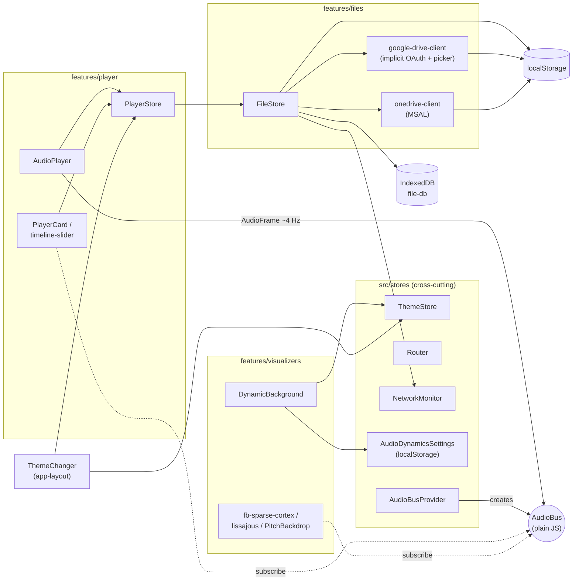
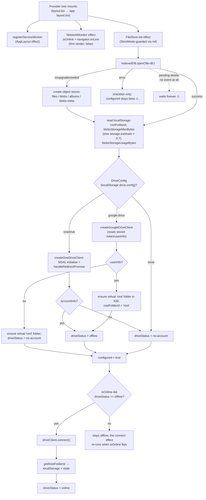
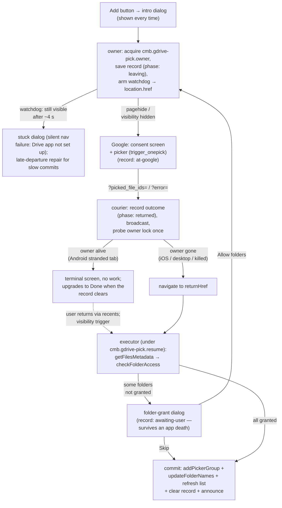

# Cloud Music Box — Architecture

Last updated: 2026-07 (after the trigger_onepick picker migration; added dependency
graph, startup flow, and picker round-trip diagrams).

## Overview

Cloud Music Box is a **static-export PWA** (Next.js 14 App Router, `output: "export"`).
There is no server runtime: OAuth flows, cloud-drive access, audio decoding/analysis,
and offline caching all happen in the browser. Offline playback is backed by IndexedDB;
the app shell is precached by a Serwist service worker.

Core design principles:

- **Client-only.** Everything runs in the browser; deployment is static files.
- **High-frequency data flows outside React.** Audio analysis frames (~4 Hz) and the
  playback position are delivered through a plain-JS pub/sub bus (`AudioBus`), never
  through React context state. React state is reserved for low-frequency UI state.
- **No singletons.** Shared services (the audio bus) are created by factories and
  injected via context providers. The instance is immutable, so providing it through
  context causes no re-renders.
- **Feature-based layout with strict placement rules** (see below).

## Folder structure and placement rules

```text
app/                       # Next.js routes. Pages compose features; keep them thin.
src/
  features/
    player/                # Playback domain
      components/          #   audio-player, player-card, timeline-slider
      stores/              #   player-store
      index.ts             #   public API
    files/                 # Cloud-drive browsing + local cache domain
      components/          #   file-list, file-list-item, track-list
      api/                 #   base-drive-client, google-drive-client, onedrive-client
      stores/              #   file-store
      index.ts             #   public API
    visualizers/           # Audio visualization domain
      components/          #   dynamic-background, fb-sparse-cortex, lissajous-curve
      lib/                 #   pitch helpers
      index.ts             #   public API
  components/              # Cross-cutting UI atoms (app-top-bar, marquee-text, covers, ...)
  stores/                  # Cross-cutting React providers (theme, network, router,
                           # audio-bus-provider, audio-dynamics-settings)
  hooks/                   # Cross-cutting React hooks
  lib/                     # Cross-cutting non-React logic (MUST NOT import React)
    audio/                 #   audio-bus, audio-frame, audio-analyser
    theming/               #   album-art color extraction (worker)
    gtag.ts
```

**Placement decision tree** (every new module resolves uniquely):

1. Is it a page? → `app/<route>/`
2. Is it specific to one domain (player / files / visualizers)? → `features/<domain>/…`
3. Is it cross-cutting UI? → `src/components/`
4. Is it a cross-cutting React provider or hook? → `src/stores/` or `src/hooks/`
5. Is it cross-cutting non-React logic? → `src/lib/` (subfolder per subsystem)

**Dependency rules:**

- Features may import freely from shared code (`src/components`, `src/stores`,
  `src/hooks`, `src/lib`).
- Feature→feature imports go through the target's `index.ts` only, and the only
  allowed edge is **player → files** (playback needs track content). The reverse
  edge does not exist: list components (`FileList`, `TrackList`) expose
  `onPlayTracks` / `activeFileId` props and the **pages** wire them to
  `usePlayerStore` — cross-feature composition happens at the page layer.
- `src/lib/` never imports React. React glue for a lib subsystem (e.g. the audio-bus
  provider) lives in `src/stores/`.
- **Bundle-isolation exception:** a page may deep-import a specific `features/*/api`
  module instead of the feature index when the index would drag heavy unrelated code
  into a lightweight route (documented at the import site). Current use:
  `app/redirect/google-drive` imports `features/files/api/google-drive-client`
  directly to avoid bundling MSAL (+220 kB) into the OAuth callback.
- `audio-dynamics-settings` lives in `src/stores/` (not in visualizers) because it is
  consumed by three domains (settings page, player-card, visualizers) — rule 4.

## Audio pipeline

```text
HTMLAudioElement (features/player/components/audio-player.tsx)
  │  timeupdate (~4 Hz while playing; also fires on seek while paused)
  ▼
createAudioAnalyser (src/lib/audio/audio-analyser.ts)
  │  • one OfflineAudioContext(44.1 kHz) is used ONLY as a decoder:
  │    decodeAudioData resamples the whole track to 44.1 kHz PCM once per track
  │  • analyze(t) slices the 0.5 s window [t, t+0.5) as zero-copy subarray views
  │    into the decoded PCM (no per-frame render, no per-frame allocation;
  │    only the final short window of a track falls back to a zero-padded copy)
  │  • pitch/RMS per channel via FFT autocorrelation on a reused 2048-sample
  │    scratch buffer (autoCorrelate mutates its input, so views are never passed)
  ▼
AudioFrame { timeSeconds, pitch0/1, rms0/1, sampleRate: 44100, samples0/1 }
  │
  ▼
AudioBus (src/lib/audio/audio-bus.ts, created per app by AudioBusProvider)
  ├─ fb-sparse-cortex   … stitches windows by file position; drives its own Logic loop
  ├─ lissajous-curve    … writes frames into a mutable render context (no re-render)
  ├─ PitchBackdrop      … pitch → CSS background color (local state in a memo leaf)
  └─ timeline-slider    … playback position display (local state in a memo leaf)
```

**AudioFrame contract:** `samples0/1` are **read-only views** into the decoded track
buffer. Consumers must never write to them (destructive processing must copy first).
Frames are immutable snapshots in the sense that the underlying decoded buffer never
changes for the lifetime of a track; on track switch old views keep referencing the
old buffer (GC keeps it alive while referenced).

**Playback position access patterns** (the player store is *not* updated at 4 Hz):

1. **Display (needs re-render):** subscribe to the bus and keep local state at the
   granularity you render (`timeline-slider` keeps raw seconds; its text is a memoized
   child receiving `~~seconds`). `bus.getLatest()` provides the initial value.
2. **Synchronous event-time read:** `playerActions.getPlaybackPosition()` — backed by
   a mutable ref (`playbackPositionRef`) noted by audio-player on every `timeupdate`
   via `notePlaybackPosition()` without dispatching. Used by the previous-track
   4-second rule.
3. **Continuous consumption (visualizers):** `AudioFrame.timeSeconds` on the bus.

Seeking still goes through the store (`changeCurrentTime` + `currentTimeChanged`),
because it is a rare, user-initiated state change.

## Stores and provider hierarchy

All stores follow the same pattern: `StateContext` + `DispatchContext`,
a `useX()` hook returning `[state, actions]`, actions memoized once with a
`refState` for fresh reads. Exceptions: `network-monitor` (plain value context)
and `audio-bus-provider` (service injection, no state).

Actual nesting (source of truth: `app/layout.tsx` and `app/app-layout.tsx`):

```text
AppRouterCacheProvider
└ ThemeStoreProvider            (MUI theme + Material You scheme from album art)
  └ AppLayout
    └ RouterProvider            (thin wrapper over next/navigation + app conventions)
      └ NetworkMonitorProvider  (isOnline)
        └ FileStoreProvider     (IndexedDB + drive clients)
          └ PlayerStoreProvider (depends on FileStore for track content)
            └ AudioDynamicsSettingsProvider  (visualizer type, appeal mode; localStorage)
              └ AudioBusProvider             (creates the AudioBus instance)
                └ AppMain
                  └ SnackbarProvider (innermost; ThemeChanger, DynamicBackground,
                                      AudioPlayer, PlayerCard, page children)
```

### Store / feature dependency graph

Arrows mean "depends on / reads". Note the only feature→feature edge is
**player → files** (PlayerStore calls FileStore for track content); everything
else composes at the page layer or goes through cross-cutting providers.



Pages (`app/*`) sit above this graph: they read FileStore/PlayerStore/Router and
wire list components to the player via props (`onPlayTracks` / `activeFileId`).
The pick-session module (`features/files/api/google-drive-pick-session.ts`) is
plain localStorage I/O used by `app/files/google-drive-page.tsx` and
`app/redirect/google-drive/page.tsx` on both sides of the picker round trip.

## Startup initialization flow

Everything below happens on every document that renders the app shell —
including the OAuth redirect pages, since `AppLayout` wraps all routes.



Notes / hazards (all verified in code):

- **`indexedDB.open` has no `onblocked` handler and no timeout**
  (`file-store.tsx:727-751`). A pending `deleteDatabase` queues the open with
  *no event at all* — `init()` never settles, `configured` never flips, and
  every page gated on it renders nothing.
- **`onversionchange` is an empty handler** (`file-store.tsx:752-755`). This
  connection never closes when another context calls `deleteDatabase`, which is
  what makes Settings → Reset App hang when a second tab (or a stranded
  redirect tab) is alive.
- **Init errors only show a snackbar** (`file-store.tsx:868-871`);
  `driveStatus` stays `"not-configured"` and `app/home` / `app/files` render
  `null` for that state — a blank screen behind a 5-second toast.
- **`NetworkMonitor` starts as `false`** until its effect runs, so the connect
  gate always fails on the first pass; connection happens on the re-render
  after `isOnline` flips to the real value.
- **MSAL redirect handling lives inside `createOneDriveClient`** — the
  `/redirect/onedrive` page itself is just a spinner; the actual token
  processing happens in FileStore init on that document. This is why the
  OneDrive redirect page needs the full provider tree, while the Google Drive
  redirect page only reads the URL and writes localStorage.
- The picker resume triggers (`use-google-drive-pick-flow.tsx`) are gated on
  `fileStoreState.configured` — if init hangs, a returned pick outcome is
  never processed.

## Files feature (cloud drives + cache)

- `api/base-drive-client.ts` — types (`BaseFileItem`, `AudioTrackFileItem`, …),
  the `BaseDriveClient` interface, `DriveConfig` (localStorage), audio format map.
- `api/google-drive-client.tsx` — OAuth 2.0 implicit flow (login) +
  `trigger_onepick` picker (top-level navigation; the in-page JS Picker is gone).
- `api/google-drive-pick-session.ts` — pick state that survives the picker's
  top-level navigation (localStorage + 10 min TTL).
- `api/onedrive-client.tsx` — MSAL + Microsoft Graph.
- `stores/file-store.tsx` — IndexedDB (`file-db`: files / blobs / blobs-meta / albums),
  LRU blob cache (70% of quota), download queue, drive-client orchestration.

## Google Drive picker round trip (trigger_onepick)

The picker is a top-level navigation, not a modal. Platform behavior at the
`location.href` hand-off differs, and it is the crux of the design:

- **Desktop / iOS PWA**: the document actually unloads; the redirect lands in
  the same (or a fresh) context and must boot the app there.
- **Android WebAPK**: Chrome diverts the out-of-scope navigation to a browser
  context and the **PWA document survives in the background**. If the Google
  Drive app is installed and set up, its App Links interception of
  `drive.google.com` breaks the return path and the redirect lands in a plain
  browser tab — next to a living app. (Storage is shared between WebAPK and
  Chrome on Android, so persisted state is visible to both.) The same divert
  is why the visualizer pairs its `beforeunload` hide with restore paths
  (`dynamic-background.tsx`).

The flow therefore runs on an **ownership contract** with three roles, keyed
to observable document liveness — never to platform sniffing:

- **Owner** — the document that started the pick. It holds the exclusive Web
  Lock `cmb.gdrive-pick.owner` for the whole round trip. Lock liveness *is*
  the ownership signal: it survives backgrounding/freezing and auto-releases
  the moment the document dies. A `pagehide` listener releases it explicitly —
  pagehide fires on a real departure (unload or bfcache entry) but **not** on
  the Android divert, which is exactly the discriminator needed.
- **Courier** — `/redirect/google-drive`. Records the outcome into the flow
  record, broadcasts a wake-up, then probes the owner lock once
  (`ifAvailable`, never waits). Owner alive → park on a terminal
  "return to the app" screen and do no pick work (the screen upgrades to
  "Done" when the executor announces completion or the record disappears).
  Owner gone → navigate to `returnHref` as before; iOS/desktop always take
  this branch because their owner died at the hand-off.
- **Executor** — whichever app document runs the continuation
  (metadata fetch → folder access check → commit). All triggers (mount,
  `visibilitychange`, `pageshow`, BroadcastChannel) funnel into one entry
  serialized under `cmb.gdrive-pick.resume`; the record's phase only advances
  when work commits, so a crash mid-resume retries on the next trigger
  against idempotent IndexedDB writes.

State that survives leaving the document lives in
`google-drive-pick-session.ts` as a phase state machine (localStorage +
10 min TTL; localStorage because iOS may hand the redirect back to a
different browsing context). The engine lives in
`features/files/hooks/use-google-drive-pick-flow.tsx`; the files page only
renders its dialogs/overlays. Everything degrades to the pre-lock behavior
when Web Locks / BroadcastChannel are unavailable.

### Two picker modes

The redirect flow above is the default, but Settings offers a second method
(`google-drive-picker-mode.ts`, localStorage `googleDrive.pickerMode`):
the classic **in-app iframe Picker** (`openFilesPicker`/`openFolderPicker`
in the drive client). Neither method is good everywhere:

|                    | redirect (default)         | in-app (iframe)             |
| ------------------ | -------------------------- | --------------------------- |
| Stays in the app   | no (Android can strand)    | yes                         |
| Consent screen     | every pick                 | first pick only             |
| Mobile multiselect | yes                        | no (upstream, one at a time)|
| iOS home-screen    | fine                       | cookie wall can dead-end it |

The modes differ **only in acquisition** — how picked results and folder
grants are obtained. Everything downstream (`continueWithPicked`: access
checks → `awaiting-user` record + grant dialog → commit + bookkeeping) is
shared. The in-app path never touches the locks, the watchdog or the
leaving/at-google phases: the document never leaves, so the ownership
contract has nothing to protect. Its own risks are covered instead by an
escape chip rendered above the picker (abort → dispose → empty resolve),
an `Action.LOADED` watchdog (~10 s) whose dialog offers "Use Google page"
as the way out, and a per-folder grant loop (the iframe picker has no
`file_ids` batch mode).

Why the iOS dead-end cannot be fixed on our side (measured 2026-07-28):
the picker's server authenticates with Google session cookies, not the
OAuth token — fetching the picker URL with a valid `oauth_token` but no
cookies returns **401** (and top-level with cookies returns **403**; the
page is iframe-only). Under iOS home-screen cookie blocking the iframe
therefore renders a dead-end sign-in dialog. Google's embedder libraries
show no Storage Access API adoption (`apis.google.com/js/api.js` and
`accounts.google.com/gsi/client`: 0 hits for `requestStorageAccess`;
GIS carries 81 FedCM references instead). The picker bundle itself can
only be searched from DevTools while a picker is open.



A cold relaunch lands on home (`start_url`), so `app/home/page.tsx` checks
`pendingPickWorkHref()` once on mount and routes back to `returnHref` when a
`returned`/`awaiting-user` record is waiting.

## Visualizers feature

Two visualizers, selected in Settings (persisted as localStorage `visualizerType`,
default `lissajous`):

- **lissajous** — the classic point-cloud Lissajous renderer (parity with `main`).
- **sparse-cortex** — cochlear filterbank → topographic sparse-coding map (SOM-like)
  → field + particle-flow rendering. Consumes raw frames from the bus and stitches
  them into a continuous sample stream by file position; its learning loop is
  fps-independent (hop-driven). Debug stats at `window.__fbcx`; `r` resets the map.

### sparse-cortex performance notes (2026-07)

- CPU hot paths are written as equivalence-preserving transforms: band-major
  filterbank with `Math.fround`-emulated f32 state (bit-identical), zero-skip
  forward pass (bit-identical), quickselect k-WTA thresholds (identical values),
  batched neighborhood cooperation (`W·Π(1−h) + x·(1−Π(1−h))`, exact composition
  of the sequential blends; only the interleave order with dictionary updates
  differs), and a per-hop dirty set that defers `updateCellVisual` to one call
  per changed cell.
- The gas layer renders into a **half-resolution offscreen RT** (`GAS_RT_SCALE`,
  half-float with 8-bit fallback) and is composited by a fullscreen triangle with
  CustomBlending ONE/ONE — mathematically equivalent to direct additive rendering
  (verified: accumulated luminance differs by ~1% vs full-res), at ~1/4 the
  fragment cost. `gl.render(points, camera)` at the end of the priority-0
  `useFrame` follows three's own FullScreenQuad pattern; a positive-priority
  `useFrame` would disable R3F auto-render.
- Uniform objects are hoisted to `useMemo` — an inline `uniforms={{...}}` prop is
  re-applied on re-render and silently resets runtime-written values.
- Verification harness (permanent): `__fbcx` exposes `audioBus`, `setSeedRng`,
  `thr`/`usage`, and stage timings (`stats.tInput/tForward/tSelect/tLearn/tVisual/
  tField/tParticles`, EMA ms) plus `stats.lastPos`. Recorded AudioFrame streams
  can be re-emitted through the bus for deterministic cross-build replays
  (checksum W/thr/usage at a target `lastPos`).

`DynamicBackground` hosts the R3F `<Canvas>` (dpr=1, module-level camera/renderer
config) and the pitch-colored CSS backdrop (`PitchBackdrop`, a memo leaf).

## Service worker / static export

- `next.config.mjs`: `output: "export"`, `basePath` from `NEXT_PUBLIC_BASE_PATH`,
  Serwist (`app/sw.ts` → `public/sw.js`, manual registration in `register-sw.tsx`),
  **manual `additionalPrecacheEntries`** (update when routes change),
  webpack splitChunks disabled (fewer files to precache), `three` transpiled.
- OAuth redirect pages parse tokens client-side (`app/redirect/*`).

## Known issues / accepted trade-offs

- Full-track `decodeAudioData` holds the whole track as PCM in memory (large for
  long FLACs). Accepted for now; windowed decode would be the next step if needed.
- Drive clients render MUI snackbar buttons (UI concern inside the api layer).
- `network-monitor` initializes `isOnline: false` (first render reports offline).
- Files with more than 2 channels use ch0/ch1 directly (the old offline-render path
  would have downmixed); practically irrelevant for music files.
- Tailwind toolchain is installed but unused (styling is MUI + Emotion).
- `getPlaybackPosition` freshness is bounded by `timeupdate` (~250 ms), same as the
  previous store-based behavior.
