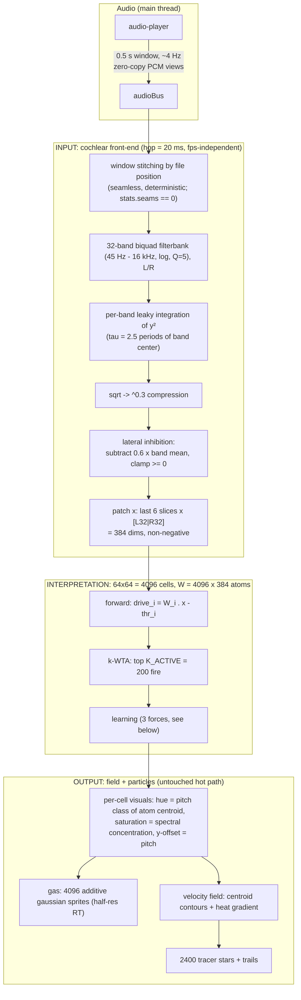
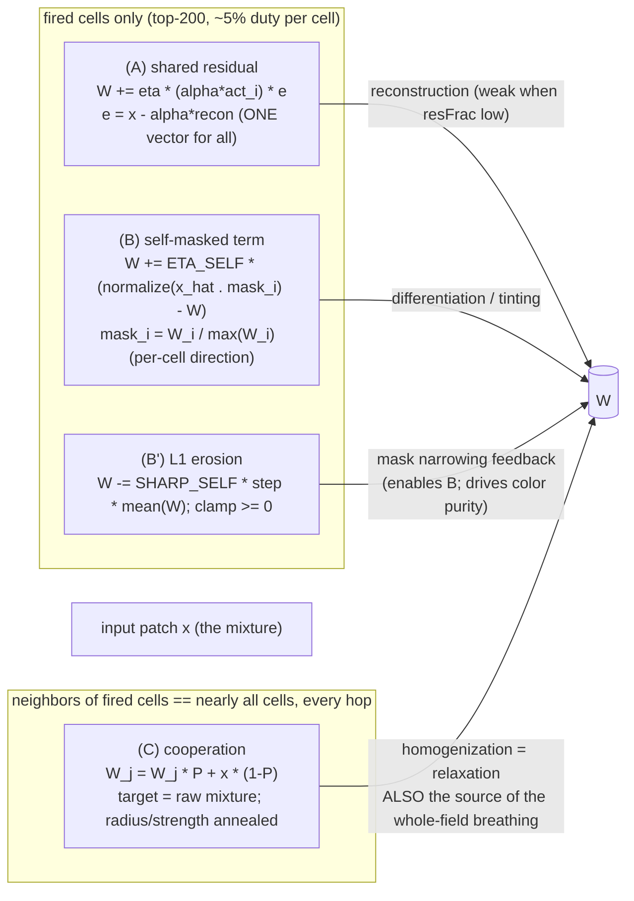
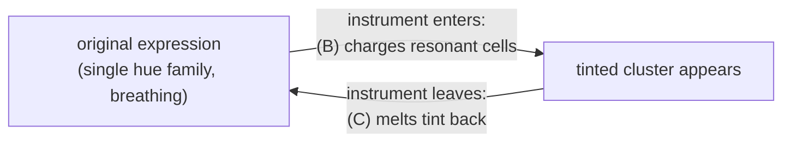

# Sparse Cortex Visualizer — Design Notes

Companion document to `docs/architecture.md`, covering only the `sparse-cortex`
visualizer (`src/features/visualizers/components/fb-sparse-cortex.tsx`).
This records the **current** design, the forces that shape what appears on
screen, the tuning state, and — importantly — the approaches that were tried
and rejected, so they are not re-attempted from scratch.

Core principle: **the interpretation layer is visualized directly.** There is no
expression layer between the learned map and the screen; putting one in between
was tried and rejected (it filters away the per-track uniqueness — see History).

---

## 1. Pipeline overview

Three layers. The chassis (field of cells + tracer particles) is fixed; all
experimentation happens in the learning rules of the interpretation layer.



Timing invariants:

- Logic is **hop-driven (20 ms = 882 samples)**, capped at `MAX_HOPS_FRAME = 2`
  per frame, never overtakes the playhead. Results are a function of audio data
  only. `stats.seams` counts stitching breaks (0 = perfectly continuous).
- Silence gate: `inputE < LOUD_FLOOR` skips seeding **and all learning**.
- Budget: whole hop ≈ 7 ms (`stats.tInput/tForward/tSelect/tLearn`).

---

## 2. Learning: the three forces on W

All learning happens inside one per-hop pass. Every cell is touched by up to
three forces; **what you see on screen is their equilibrium.**

Notation:

- `x` = `featVec`, the 384-dim patch (non-negative; `|x|² = inputE` ∝ loudness).
- `x_hat` = `x / |x|` — the *shape* of the current sound with loudness removed
  (code: `featVec[d] * xInv`).
- Caveat worth remembering: in the self-masked target the `1/|x|` and the
  `1/max(W)` are plain scalars and **cancel inside the final normalize** —
  the target's direction is exactly `normalize(x ∘ W_i)`. They are kept for
  conceptual clarity ("the input heard through the own filter, peak-1 mask")
  and float conditioning, not because they change the result.



### (A) Shared residual (original)

One global residual `e` for every fired cell; only the scalar `alpha*act_i`
differs. **Within a hop it cannot separate co-firing cells** (their difference
changes only along `e`; renormalization contracts everyone toward a common
pole). Differentiation through different firing histories is possible in
principle, but in the plain original it was dead in practice — measured: fired
cells were no more diverse than never-fired cells (pairCos 0.9205 vs 0.9383).

### (B) Self-masked term (added; the differentiator)

"Each cell listens to the world through its own filter and tunes to what it
hears." The target `normalize(x_hat ∘ W_i/max W_i)` differs per cell, so
co-firing cells can diverge. Which part a cell adopts is decided by **when it
fires** (k-WTA as temporal gate) plus its seed jitter.

**This term uses NO residual and does NOT partition the input.** All 200 fired
cells independently see the FULL `x` through their own mask; overlapping masks
take the same energy twice — there is no exclusivity and no accounting. The
only place a residual exists is term (A), and it is handed to everyone
*identically* (scaled by each cell's `act_i`), not divided. A true exclusive
partition of `x` (explaining-away: each winner subtracts its claim before the
next) existed only in the rejected matching-pursuit stack (`d1b36fd`) — reach
for that if exclusivity is ever needed.

**Critical coupling: (B) is inert without (B').** With a broad mask,
`x_hat ∘ mask ≈ x_hat` and the term is just another mixture-follower
(measured: `ETA_SELF=0.015, SHARP_SELF=0` → pairCos 0.997 = zero effect).
The L1 erosion narrows the support, which narrows the mask, which makes the
target a *part* — a positive feedback loop. `SHARP_SELF` therefore controls
both *whether differentiation happens at all* and the *color purity/saturation*
of the resulting tint (display saturation = spectral concentration of the atom).

Mechanics of the erosion (`cutS = SHARP_SELF * sStep * mean(W)`): a uniform
subtraction from all 384 components followed by the `clamp >= 0` — i.e. the
proximal operator of an L1 penalty (soft-thresholding). Components persistently
below ~`SHARP_SELF x mean` cannot be replenished by the data term and sink to
zero; the subsequent renormalization redistributes their norm onto the
survivors, so strong bands grow — *use it or lose it*. Note the coupling:
`cutS ∝ ETA_SELF x SHARP_SELF`, so raising `ETA_SELF` also strengthens the
absolute erosion; `SHARP_SELF` sets the erosion/charge *ratio*.

### (C) Cooperation (original, kept deliberately)

Fired cells blend their (annealed-radius) neighborhoods toward the **raw
mixture x**. It is the homogenizer that kept the plain original monochrome —
but it is also **the source of the original's beauty**: the whole field
rewritten every hop toward the live sound is what makes the nebula breathe with
the music. Deleting it (tried) kills the base look. In the current design it
plays a second role: **relaxation** — it melts instrument tints back into the
mixture when the instrument stops.

Annealing (Kohonen schedule) applies to (C) only: radius 12→3, strength
0.05→0.004, `tau = 25 s` of *audible* audio time; effectively two phases,
coarse alignment until ~45 s, local polish forever after. Resets with the map
(`r` key / reload).

### (D) Residual second round (selection + recruitment; 2026-08-02)

Target: the user's stated best case — *"a NEW instrument joins while others keep
playing → a new cluster appears"*. Plain k-WTA scores the raw mixture, so an
added part's would-be specialists can never outscore the mixture-matchers; the
selection stage itself has to be given the unexplained part.

Mechanism (`K2_ACTIVE = 48`, `R2_MIN_E = 0.04`, `R2_MIN_COS = 0.02`,
`R2_GAIN = 1`; the last two live-tunable via `__fbcx.selfTune.r2cos/r2gain`):

1. Round 1 runs exactly as before; its existing `recon`/`alpha`/`resid`
   computation is reused.
2. When `resE > R2_MIN_E * inputE`, every non-round-1 cell is scored `W · resid`
   and up to `K2_ACTIVE` winners above a small cosine floor fire additionally
   (`stats.nWin2`; they pour heat at their own location on their own ramp).
3. Round-2 winners **learn toward the residual** with the same shared-residual
   rule as round 1 (`aeff = r2gain · y2 · sqrt(resE)` instead of `alpha·act`).
   This is essential: a truly novel sound matches *nobody* at first (best
   cos(W, resid) measured ≈ 0.03), so selection alone can never bootstrap. A
   coherent residual picks the same near-match cells hop after hop and learning
   compounds; an incoherent (noise) residual picks different cells each hop and
   the L1 cut prunes the thin junk.

**Measured verdict (aged-map synthetic: 220 Hz aged 72 s past anneal, then
3 kHz added on top; plus real-track sanity):**

- Entry detection is precise and honest: `nWin2` 0 → 33–48 on the very hop the
  second tone enters, breathing 0–48 through the absorption window. On the real
  track round 2 is active on ~27 % of hops (avg 5–13, peaks 48 in rich
  passages), silent on mono textures. Perf cost negligible (tLearn ≈ 2.8 ms).
- Recruit learning compounds as designed: cos(top recruit, resid) noise 0.04 →
  0.30 at `r2gain = 1`, → 0.82 sustained at `r2gain = 4`.
- **A persistent separate district does NOT form, and the reason is
  structural, not a tuning miss.** Two independent blockers, both measured:
  1. *Washout*: cooperation (C) pulls every active neighborhood toward the live
     mixture at ~0.01–0.03/hop — round-2 recruitment at gain 1 (~0.007/hop
     effective) loses the race, and within seconds the round-1 elite absorbs
     the new part into their own weights (resFrac back to 0.03–0.08, gate
     closes, recruitment stops reinforcing).
  2. *Graduation blocked*: once the elite is mixture-tuned, a pure-B specialist's
     drive on the mixture (LS orthogonality gives a residual-tracker exactly
     `sqrt(resE)` ≈ 0.5, and even a true B-specialist ~0.6 of max) never beats
     the 82nd mixture-matcher. End state measured: input B/A ratio swinging
     0.42 → 1.27 across tremolo phases changes the round-1 winner set by
     **zero cells**.
- What the mechanism therefore *does* deliver: a **transient entry bloom** —
  extra glow away from the current winners for the ~10–20 s it takes the field
  to absorb the newcomer — i.e. the *moment* of appearance is visible, the
  permanent district is not. Note the synthetic steady superposition (both
  tones always on) is the worst case; real music keeps re-opening the residual
  at every entry/change, which is why round 2 keeps breathing there.

Persistent per-instrument districts under constant superposition would require
parts-based competition (winners penalized for redundantly covering the same
bands — true sparse coding), which means changing (A)/(C)'s "everyone absorbs
the mixture" dynamics — the load-bearing aesthetic machinery. That trade-off is
a product decision, not a tuning knob.

### Support systems

- **Seeding**: on the first audible hop, all 4096 cells are batch-initialized
  from the first real patch + jitter (±0.04). No random init, no growth.
- **IP homeostasis**: overused cells accumulate `thr` (cap 0.3, gamma 2e-5 —
  minutes-scale rotation). Prevents permanent winner lock-in, slowly.
- **k-WTA**: `K_ACTIVE = 82` (a 200 experiment was tried and reverted — "more
  cells barely changes it"; the author comment records 12 = differentiation-first,
  82 = monochrome).

---

## 3. The design tension (read before tuning anything)

**The original expression and per-instrument color clusters compete for the
same channel: hue.**

- The original look = the whole field in ONE hue family, breathing with the
  music. It exists *because* the atoms are homogeneous.
- Instrument clusters expressed through color = differentiated atoms = several
  hues on screen at once. Every static-differentiation scheme converges to
  "confetti / stained glass", which is a *different* expression.

The current design resolves this by **time-sharing the hue channel**
("transient tint"): equilibrium between (B) charging (fired-only, ~5% duty)
and (C) relaxation (always-on). Cells catching a distinctive instrument tint
*while it plays* and melt back after. Quiet/tutti-average state = the original
single-hue breathing.



### Tuning state (2026-08-02)

| ETA_SELF | SHARP_SELF | pairCos @ ~105 s | hue spread (bands, p5–p95) | hue flicker (bands/s, lit cells) | verdict |
| --- | --- | --- | --- | --- | --- |
| 0 | — | ~0.93 | ~1 | — | exactly the original |
| 0.015 | 0 | 0.997 | — | — | zero effect (mask stays broad) |
| 0.06 | 3 | 0.987 | — | — | direction correct, ~10x too weak |
| 0.06 | 6 | 0.964 | 2.2 | 0.25 | sharp cannot compensate for missing charge |
| **0.12** | **3** | **0.892** | **2.8** | **0.27** | **chosen (user): calmest regime with a real effect — controlled A/B vs ETA=0 measured hue spread 1.6 → 3.9 bands (2.4x), pairCos 0.967 → 0.896** |
| 0.12 | 6 | 0.774 | 2.4 | 0.65 | deeper but narrower colors |
| 0.18 | 3 | 0.891 | 2.4 | 0.42 | (run-to-run noise ≈ ±0.05 visible here) |
| 0.25 | 3 | 0.654 | 4.5 | 0.63 | deepest tint with widest spread; previously chosen, but drifts toward mosaic/white cells at high delta |
| 0.25 | 6 | 0.215 | 2.3 | 1.27 | over-differentiated, flickery (past the window) |

Method: real track looped from t=0, map reset (`r`) between runs, ~105 s of
audible audio each, metrics via `__fbcx` (`selfTune` is live-tunable for this).
Note `SHARP_SELF` above ~3 *narrows* the hue spread even as pairCos drops:
extreme sparsity concentrates atoms onto few dominant bands. Depth is driven by
`ETA_SELF`, and 0.25 sits just past a nonlinear threshold (0.12→0.18 barely
moved, 0.25 jumped).

The window exists: tint depth is governed by `ETA_SELF` against the always-on
relaxation (charge is diluted by the ~5% firing duty), and the aesthetic
failure mode on the far side is `SHARP_SELF`-driven flicker/confetti (the
standalone build hit pairCos 0.215–0.265 — maximal separation, rejected look).
If deeper tints are ever needed beyond `ETA_SELF`, the other lever is weakening
the antagonist one notch (`ETA_NB` 0.004 → 0.002) at the cost of drifting
further from the original.

Reference measurement (pairwise atom similarity over 300 random pairs):

```js
const f=__fbcx,{DIM,W}=f,N=f.G*f.G
const cos=(i,j)=>{const a=i*DIM,b=j*DIM;let d=0,na=0,nb=0
  for(let k=0;k<DIM;k++){d+=W[a+k]*W[b+k];na+=W[a+k]**2;nb+=W[b+k]**2}
  return d/(Math.sqrt(na*nb)+1e-12)}
let s=0;for(let t=0;t<300;t++)s+=cos((Math.random()*N)|0,(Math.random()*N)|0)
s/300  // ~0.93 = original/homogeneous, lower = differentiated
```

---

## 4. History: tried and rejected (do not re-attempt blindly)

| Approach | Result | Why rejected |
| --- | --- | --- |
| Expression layer on top of the interpretation layer (pre-history) | information bottleneck | per-track uniqueness filtered away → led to the "visualize the map directly" principle |
| Full separation stack: matching pursuit + non-negative residual + atom L1 + recruitment + exclusive territories + district readout | true instrument districts (all 4 parts on synthetic; arrangement-tracking nWin 14→32 on real tracks) | look destroyed: frozen geography, then sparse/dark district display; three display reworks all degraded the original expression. Preserved in commit `d1b36fd` |
| Hidden 64-atom detector + brightness envelope over the untouched original | detector worked (15 parts, graded claims) | envelope is a pure attenuator (env ≤ 1) and anchors crowd (homogeneous map has no instrument geography) → "swells get dimmer", removed |
| Render-space position dynamics (cells drift, common-fate attraction) + self-masked learning | strongest differentiation of the project (pairCos 0.265); genuine congregation began | broke the render contract *lattice neighbor = screen neighbor*: particle bilinear sampling across discontinuous positions → screen-wide streak artifacts; after smoothing fixes still "not the original expression" |
| Swap sorting (contents trade between dim sites; positions fixed) | sorting gain 1.7x in ~2 min, no artifacts possible | static multi-hue result — again not the original expression; shelved (viable if static regions are ever wanted) |
| Anneal freeze at 20 s | whole field richly alive | moves as ONE cluster — confirmed that wide cooperation = liveliness without separation |

Standing lessons:

1. **Never modify the OUTPUT layer to express separation.** Every display
   rework (discs, district ramps, envelopes, per-hop peak normalization)
   degraded the original. Peak-of-this-hop normalization in particular causes
   "one cluster answers, the rest go dark".
2. **Cooperation is load-bearing for the aesthetics.** It is a homogenizer
   *and* the breathing of the field. Remove it and the background dies.
3. Verification: real tracks play fine in the automated browser via a plain UI
   click (album page → track row). `audioBus.emit` injection is for controlled
   synthetic experiments only — and gated multi-instrument signals (coprime
   on/off periods) are required, or "the mixture" is the mathematically correct
   single answer and nothing separates.
4. Reload after every code edit before measuring (Fast Refresh leaves hybrid
   state).

---

## 5. Debug surface

- `window.__fbcx`: `G M DIM seeded mature heat W thr usage centroidArr featVec
  env2 stats drive drive2 selfTune audioBus setSeedRng setHemiScale setHemiBeta
  setFlat setRound`.
- `stats`: `mapAge` (audible seconds; annealing clock), `seams`, `resFrac`,
  `kThr`, `nWin2` (round-2 winners this hop; 0 = nothing unexplained), stage
  timings `tInput/tForward/tSelect/tLearn/tField/tParticles`.
- `selfTune` (live-tunable): `eta sharp` (§2 (B)) and `r2cos r2gain` (§2 (D)).
- `r` key: reset map (weights, seeding, annealing clock; cochlear filter state
  intentionally survives).
- `g` key: flat-lattice debug view; `,` / `.`: hemisphere roundness λ ±0.05.
- W and mapAge live only in component memory: reload / visualizer switch loses
  the learned map and restarts annealing.

---

## 6. Prior art

The self-masked rule was derived inside this project from measured failure
constraints (no other-part leakage, per-cell target, no staying broad), but
every ingredient has an established lineage. Connections were identified
post-hoc and the mapping is not an exhaustive literature survey.

| Ingredient here | Lineage | Reference |
| --- | --- | --- |
| Parts from non-negative mixtures; multiplicative structure; **zeroed components never return** (the one-way door of §2 (B)) | Non-negative matrix factorization | Lee & Seung, *Learning the parts of objects by non-negative matrix factorization*, Nature 401 (1999); Lee & Seung, *Algorithms for NMF*, NIPS (2001) |
| Learn toward the **match between input and own weights**; support only narrows — the closest single relative of the self-masked target (correspondence verified against the primary source, see below) | Adaptive Resonance Theory | Carpenter & Grossberg, CVGIP 37 (1987); Carpenter, Grossberg & Rosen, *Fuzzy ART*, Neural Networks 4 (1991) |
| Fire-gated "move the winner toward the input"; differentiation via biased diets (temporal gating) | Competitive learning | Rumelhart & Zipser, *Feature discovery by competitive learning*, Cognitive Science 9 (1985) |
| The lattice, neighborhood cooperation and the annealing schedule of the base implementation | Self-organizing maps | Kohonen, *Self-organized formation of topologically correct feature maps*, Biological Cybernetics 43 (1982) |
| L1 erosion = soft-thresholding inside the learning step (§2 (B') is the proximal operator of an L1 penalty) | Sparse coding / iterative shrinkage | Olshausen & Field, Nature 381 (1996); Daubechies, Defrise & De Mol, Comm. Pure Appl. Math 57 (2004) |
| Element-wise `normalize(x ∘ W)` iteration = per-component power method (the rich-get-richer amplifier of seed jitter) | Power iteration (standard linear algebra) | — |
| Explaining-away / exclusive partition of the input (the rejected `d1b36fd` stack; the tool to reach for if exclusivity is ever needed) | Matching pursuit; Oja's rule for the per-winner update | Mallat & Zhang, IEEE Trans. Signal Processing 41 (1993); Oja, J. Math. Biology 15 (1982) |

### ART correspondence, verified against the 1991 paper

Checked directly against Carpenter, Grossberg & Rosen, *Fuzzy ART*, Neural
Networks 4(6), 1991 (Boston University copy). The relevant primitives, as
printed there:

- Learning (their eq. 8): `w_J(new) = beta * (I AND w_J(old)) + (1-beta) * w_J(old)`
  with fuzzy AND = component-wise min; fast learning is `beta = 1`.
- Category choice (eq. 2): `T_j = |I AND w_j| / (alpha + |w_j|)`; single
  winner-take-all node; ties break to the smallest index.
- Vigilance / reset (eqs. 6-7): resonance iff `|I AND w_J| / |I| >= rho`, else
  the node is reset and search continues.
- Stability: "each LTM trace w_ij is **monotone nonincreasing** through time
  and hence converges to a limit"; abstract: "Learning is stable because all
  adaptive weights can only decrease in time."
- "ART 1 learns **prototypes**, rather than exemplars, because the attended
  feature vector X* [= I matched against the expectation], rather than the
  input I itself, is learned."
- Fast-commit slow-recode: `beta = 1` on first commitment, `beta < 1`
  afterwards, to buffer memory against noise. Complement coding (on/off cells)
  prevents category proliferation.

Verified alignments with the self-masked rule:

1. **Same functional form of the update.** Their eq. 8 is an EMA toward the
   *match of input and own weights*; ours is `W <- (1-sStep) W + sStep *
   normalize(x . W)` — identical structure with `beta <-> sStep` and
   `min(I, w) <-> normalize(x . W)` as the match operator.
2. **Learn the match, not the input** — the ART principle quoted above is
   exactly the self-mask's premise (and why neither degenerates into plain
   mixture averaging the way input-target rules do).
3. **One-way support door.** min: where `w = 0`, `I AND w = 0` forever. Ours:
   where `W_d = 0`, `t_d ∝ x_d W_d = 0` forever. Both prototypes can only
   narrow their support.

Verified differences (the analogy's limits):

1. **Monotonicity scope.** Fuzzy ART: every individual weight is monotone
   nonincreasing and learning *converges and stops*. Ours: only the *support*
   is monotone; surviving components can grow (unit-sphere renormalization),
   and nothing converges — cooperation (C) deliberately re-broadens atoms.
   Our transient-tint design *intentionally violates* ART's core stability
   property; their fast-commit slow-recode is a cousin mechanism but aims to
   prevent forgetting, ours to cause it.
2. **min cannot amplify.** `min(I, w)` caps components; our product +
   renormalization amplifies relative differences (the power-iteration
   rich-get-richer that turns seed jitter into specialization). That
   ingredient is absent from ART.
3. **Selection.** ART: one winner, explicit vigilance/reset search,
   commitment. Ours: K_ACTIVE=200 simultaneous winners, no vigilance, no
   reset, no commitment.
4. No analog of complement coding / proliferation control on our side; ART
   weights are not norm-constrained, ours live on the unit sphere.

Position statement: the *combination* — unit-sphere EMA toward
`normalize(x ∘ W_i)` with mean-scaled L1, added next to a shared-residual term
with SOM cooperation as the deliberate antagonist to produce *transient* tints
— has no known exact precedent to us, but similar formulations plausibly exist
in the audio-NMF / ART-descendant literature. Treat it as a re-synthesis of
classical ingredients, not an invention.
